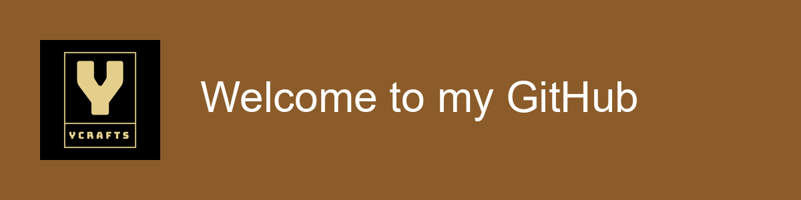

  
  
  <h1>Hi, I'm Yonatan 👋</h1>
  
<b>Software Engineering Student | Full-Stack Developer | Problem Solver</b>

---

## 🚀 About Me

As a pre-final year Software Engineering student at Bahir Dar University, I have a deep-seated passion for solving complex problems and building things that last. I truly enjoy the challenge of designing and playing with data, architecting database schemas that are both efficient and scalable.

I recently completed a remote backend internship at Prodigy Infotech, where I gained valuable real-world experience and received a certificate for my contributions ([view certificate](Yonatan%20Assefa%20Mekonnen_Prodigy%20Infotech%20Certificate.pdf)).

While I am proficient across a wide variety of programming languages and frameworks, my greatest strength lies in collaboration. I excel in team environments where I can contribute to a shared vision and learn from others. I am now eager to bring my technical skills and collaborative spirit to the software industry and begin tackling real-world challenges.

---

## 🛠️ Skills & Tools

  
  
  
  
  
  
  
  
  
  
  
  
  
  
  
  

🧰 <b>More Skills</b>

- Version Control: Git & GitHub
- Frontend: JavaScript, React, Bootstrap
- Backend: Python, Django & DRF, Java, Spring Boot, PHP, Laravel
- Mobile: Flutter
- Databases: PostgreSQL, MS SQL Server
- Other: C++, REST APIs

---

## 📌 Pinned Repositories

<table>
  <tr>
    <td><b>My portfolio</b></td>
    <td>My personal portfolio website showcasing my projects, skills, and experience. 
      <a href="https://github.com/Ycrafts/main_portfolio">GitHub</a> | <a href="https://main-portfolio-theta-virid.vercel.app/">Live Demo</a>
    </td>
  </tr>
  <tr>
    <td><b>AACEAC</b></td>
    <td>
    An employee tracking system for the Addis Ababa
    City Ethics and Anti-corruption Commission
    (AACEAC). It provides a comprehensive system for
    managing employees, their roles, and their positions
    within the commission's hierarchical organization.
     
      <a href="https://github.com/Ycrafts/AACEAC">GitHub</a>
    </td>
  </tr>
  <tr>
    <td><b>Local Services Aggregator System</b></td>
    <td>An application that serves as a platform for
        aggregating local services. It connects customers
        who need services with local providers who can
        offer them.
     
      <a href="https://github.com/Ycrafts/Local_Services_Aggregator_System">GitHub</a>
    </td>
  </tr>
</table>

---

## 📊 GitHub Stats

 
  

---

## 🎸 Fun Facts

- 👨‍💻 I love collaborating and learning from others.
- 🧩 I enjoy solving complex problems and designing scalable systems.
- 🎶 I play bass guitar in a band!

---

## 📫 Contact

- [LinkedIn](https://www.linkedin.com/in/yonatan-assefa-mekonnen/) 
- 📧 Email: yonatanassefa60@gmail.com

---

Thanks for visiting my profile! 🚀

